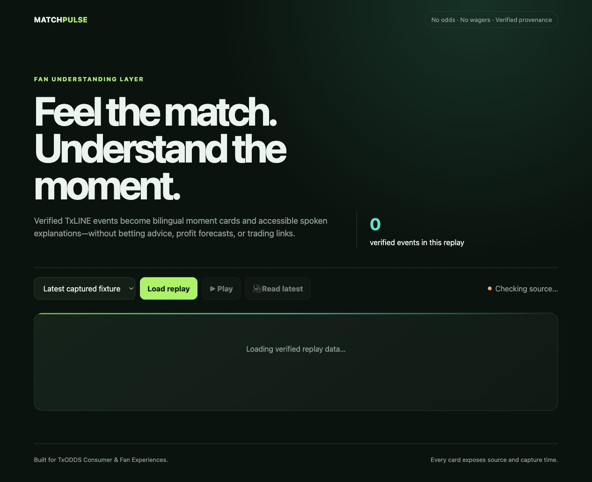

# EarnSignal

EarnSignal is an evidence-first Web3 income engine built on Cloudflare Workers, D1, Cron Triggers, Workers AI, Hono, and Solana x402. It discovers legitimate work opportunities, applies deterministic safety gates, ranks expected value, records execution and revenue, and publishes a non-betting TxLINE fan experience called MatchPulse.

The system never signs transactions, sends funds, deploys contracts, approves tokens, creates wallets, or changes wallet permissions. Those actions require an explicit human checkpoint outside the Worker.

## Live deployment

- Production API: <https://earnsignal.detroxryo.workers.dev>
- Human API guide: <https://earnsignal.detroxryo.workers.dev/docs>
- Agent discovery: <https://earnsignal.detroxryo.workers.dev/llms.txt> and <https://earnsignal.detroxryo.workers.dev/openapi.json>
- MatchPulse: <https://earnsignal.detroxryo.workers.dev/matchpulse>
- Operator console: <https://earnsignal.detroxryo.workers.dev/admin> (Bearer-protected data)
- Current public status: payments and TxLINE live capture remain disabled until their human wallet checkpoints are completed; discovery, scoring, Workers AI, and reports are live. Both Cron triggers are deployed, and the protected readiness endpoint independently monitors their successful delivery and report freshness.

## 60-second reviewer path

1. Open [health](https://earnsignal.detroxryo.workers.dev/health) to verify production, D1, and activation flags.
2. Open the [ranked opportunity feed](https://earnsignal.detroxryo.workers.dev/v1/opportunities/top) to inspect deterministic low-risk candidates.
3. Open [MatchPulse](https://earnsignal.detroxryo.workers.dev/matchpulse) to review the no-betting and accessibility boundary.
4. Read the [daily evidence report](./docs/REPORT_2026-07-17.md) and inspect the test suite for payment, scoring, Cron, source, and page guards.
5. Read the [official Grant prompt response](./docs/GRANT_RESPONSE.md) for the next 30-day Solana delivery plan.



## What is implemented

- Hourly opportunity discovery from the authenticated Superteam Agent API, GitHub Search, CDP Bazaar, Execution Market H2A, and TaskBounty, plus a curated official-opportunity registry.
- Deterministic 0–100 scoring with the mission's fixed weights and hard rejection rules.
- Generic GitHub reward discovery is fail-closed until a dedicated platform adapter verifies funding, payout terms, and operator-region eligibility. Bounded platform-bot enrichment can add a more specific region rejection; production is configured for `CN`.
- Execution Market escrow evidence is checked at most five times per discovery against its task payment timeline and Base mainnet transaction/receipt. The verifier requires the documented Facilitator, PaymentOperator, AuthCaptureEscrow, Base USDC, token collector, fee bounds, exact amount, successful receipt, authorization event, and transfer event. It deliberately retains `PAYOUT_UNVERIFIABLE`: the on-chain `PaymentInfo` contains a random salt but does not commit to the task UUID, so the platform-controlled timeline is not independent task binding.
- TaskBounty candidates require authoritative detail state `OPEN` plus `FUNDED`; its list filter, list-level competition count, and arbitrary explorer URLs are never treated as payout proof.
- D1 persistence for opportunities, evaluations, executions, ledger entries, reports, Cron idempotency, AI budgets, and captured TxLINE events.
- Daily opportunity, execution, revenue, and improvement reports at 00:00 Asia/Shanghai (`0 16 * * *` UTC).
- Secret-safe automation freshness checks for hourly discovery, daily Cron delivery, and the persisted daily report snapshot; missing or stale evidence produces a `DEGRADED` track instead of being hidden by a manual backfill.
- Workers AI bilingual explanations using `@cf/qwen/qwen3-30b-a3b-fp8`, with low temperature, bounded inputs, a D1-enforced daily budget, and deterministic fallback.
- Solana x402 `exact` payment middleware for a $0.10 evaluation and a $5 full implementation plan.
- Settlement-ledger deduplication by chain and transaction hash; self-payments and controlled payer addresses are excluded from revenue.
- MatchPulse live fixtures, official score capture, verified replay, bilingual explanations, browser TTS, and an explicit no-betting interface.

## API

| Method | Route | Access | Purpose |
|---|---|---|---|
| GET | `/health` | Public | Runtime, D1, payments, and TxLINE status |
| GET | `/docs` | Public | Human-readable API guide and pilot request entry point |
| GET | `/llms.txt` | Public | Agent-readable capabilities and payment safety |
| GET | `/openapi.json` | Public | OpenAPI 3.1 schema for evaluation clients |
| GET | `/v1/opportunities/top` | Public | Low-risk candidates scoring at least 70 |
| POST | `/v1/evaluate/preview` | Public | Free score range and hard-risk preview |
| POST | `/v1/evaluate` | x402, $0.10 USDC | Full evidence and EV evaluation |
| POST | `/v1/evaluate/full` | x402, $5 USDC | Evaluation plus implementation plan |
| GET | `/matchpulse` | Public | MatchPulse fan experience |
| GET | `/v1/matchpulse/fixtures` | Public | TxLINE live-fixture availability |
| GET | `/v1/matchpulse/replay` | Public | Captured, provenance-bearing events only |
| POST | `/v1/matchpulse/brief` | Public | Bilingual, no-betting event explanation |
| GET | `/admin` | Public shell | Browser operator console; protected data still requires Bearer auth |
| GET | `/admin/reports/daily` | Bearer | Four daily reports |
| GET | `/admin/readiness` | Bearer | Secret-safe activation and Cron/report freshness checklist |
| POST | `/admin/discovery/run` | Bearer | Manual discovery trigger |
| POST | `/admin/reports/generate` | Bearer | Idempotent daily report generation |
| POST | `/admin/matchpulse/capture/:fixtureId` | Bearer | Capture official TxLINE score events |
| POST | `/admin/opportunities/:id/transition` | Bearer | Human-reviewed state transition |
| POST | `/admin/superteam/submissions/queue` | Bearer | Queue a reviewed, public artifact for an eligible Agent API listing |
| POST | `/admin/superteam/submissions/process` | Bearer | Process the idempotent queue, capped at three submissions per day |

## Local setup

Requirements: Node.js, pnpm, a logged-in Wrangler session, and a Cloudflare account.

```bash
pnpm install
cp .env.example .dev.vars
pnpm types
pnpm db:migrate:local
pnpm dev
```

Run the full local gate:

```bash
pnpm check
```

Test a scheduled event locally:

```bash
curl "http://localhost:8787/cdn-cgi/handler/scheduled?cron=0+*+*+*+*"
```

## Cloudflare setup

Create separate D1 databases and replace the placeholder IDs in `wrangler.jsonc`:

```bash
pnpm wrangler d1 create earnsignal-staging
pnpm wrangler d1 create earnsignal
pnpm db:migrate:staging
pnpm db:migrate:production
```

Add secrets by stdin or an interactive terminal. Never place them in source or shell history:

```bash
pnpm wrangler secret put ADMIN_TOKEN --env staging
pnpm wrangler secret put SUPERTEAM_AGENT_API_KEY --env staging
pnpm wrangler secret put GITHUB_TOKEN --env staging
```

Production x402 additionally needs `X402_RECEIVER_ADDRESS`, `CDP_API_KEY_ID`, and `CDP_API_KEY_SECRET`. Set `PAYMENTS_ENABLED` to `true` only after the receiver is verified and a human explicitly authorizes a real payment test.

## TxLINE checkpoint

TxLINE access needs a guest JWT and API token. Even its free service requires a Solana subscription transaction and a signed activation message. EarnSignal does not perform either step. After a human completes the official flow, set `TXLINE_GUEST_JWT` and `TXLINE_API_TOKEN` as Worker secrets, then set `TXLINE_LIVE_ENABLED` to `true`. MatchPulse intentionally shows an empty verified replay before this checkpoint rather than substituting synthetic data.

## Revenue definition

Revenue is counted only when all of these are true:

1. the x402 facilitator reports a successful settlement;
2. a transaction hash and expected Solana network are present;
3. the chain/transaction pair is new;
4. the payer is not the receiver and is not listed in `CONTROLLED_PAYER_ADDRESSES`;
5. the ledger status is `CONFIRMED`.

Self-tests, internal transfers, testnet assets, excluded transactions, and pending rewards are never reported as earned revenue.

## Opportunity score

| Component | Weight |
|---|---:|
| Payout evidence and reputation | 20 |
| Success probability | 15 |
| Expected net value per hour | 15 |
| Capital safety | 15 |
| AI/skill fit | 10 |
| Deadline fit | 10 |
| Competition | 5 |
| Repeatability | 10 |

`>=70` executes, `55–69` watches, and `<55` rejects. Any hard risk forces rejection and caps the score below 55.

## Project artifacts

- [Security boundaries](./SECURITY.md)
- [72-hour operator runbook](./docs/OPERATIONS.md)
- [Activation checkpoints](./docs/ACTIVATION_CHECKPOINTS.md)
- [Grant application draft](./docs/SUPERTEAM_GRANT.md)
- [Official Grant prompt response](./docs/GRANT_RESPONSE.md) and [reviewer PDF](./output/pdf/earnsignal-superteam-agentic-engineering-grant.pdf)
- [MatchPulse submission draft](./docs/TXODDS_SUBMISSION.md)
- [Ethical outreach templates](./docs/OUTREACH.md)
- [2026-07-17 opportunity, execution, revenue, and improvement report](./docs/REPORT_2026-07-17.md)
- [2026-07-19 opportunity, execution, revenue, and improvement report](./docs/REPORT_2026-07-19.md)
- [MatchPulse production dogfood QA](./docs/qa/MATCHPULSE_2026-07-17.md)

## License

MIT. See [LICENSE](./LICENSE).
